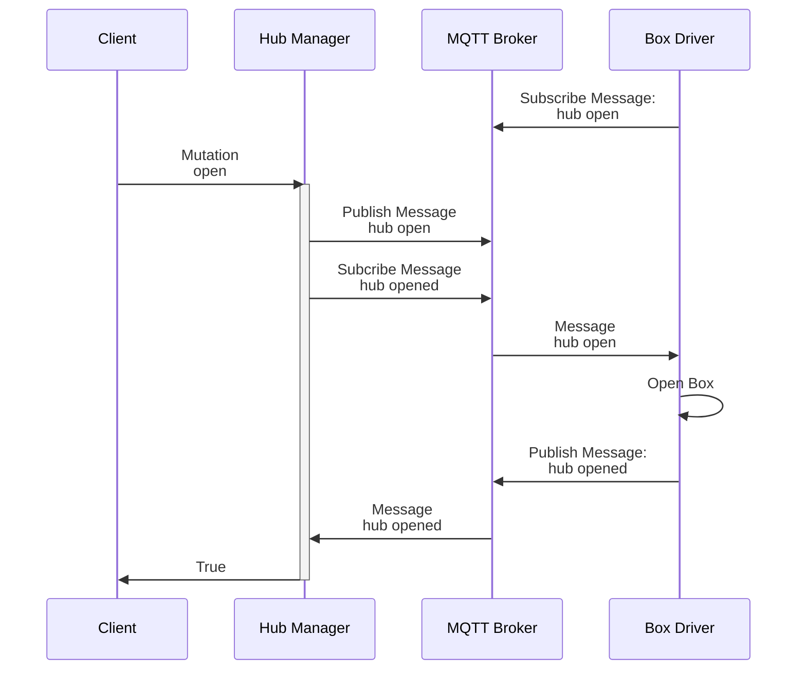

# Senior Backend Coding Challenge - Node.js

## Introduction

Welcome to the Senior Backend Coding Challenge! This challenge is designed to assess your skills in Node.js, GraphQL, MQTT, and Redis. You'll be working with two services: the "Hub Manager" and the "Box Driver."

### Hub Manager Service

This service exposes a GraphQL API and is responsible for managing the state and actions of the "Box Driver"

### Box Driver Service

This service simulates a remote hardware component with multiple compartments that can be opened and closed.

Both services communicate with each other using MQTT, and Redis is used for storing state and Pub/Sub functionalities.

### Sequence Diagram



## Tasks

### Task 1: Monitoring Resolver

Your first task is to create a GraphQL resolver that can determine whether the Box Driver is online or not. This will be crucial for monitoring the health of the system.

### Task 2: Open and Close the Box

Implement the functionality to open and close the compartments in the Box Driver through the Hub Manager's GraphQL API. Make sure that the state is accurately reflected and stored.

### Task 3: Failure Mode and Online State

Enable a "Failure Mode" in the system (see `.env` in `box-driver`). In this mode, the Box Driver simulates a network disconnect in a regular interval

How would you ensure that interactions that occurred when the Box Driver was offline are still processed once it comes back online?

## Getting Started

1. Clone the boilerplate repository.
2. Run `pnpm install` to install all required dependencies
4. Navigate to the `Hub Manager` and `Box Driver` directories to understand the existing codebase.
5. Start implementing the tasks.

The servers are started via:
```
pnpm nx serve hub-manager # Starts the hub-manager
pnpm nx serve box-driver # Starts the box-driver
docker-compose up # Starts the MQTT broker and a Redis instance
```

Good luck!
